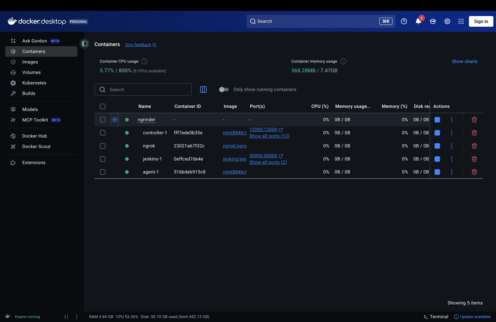
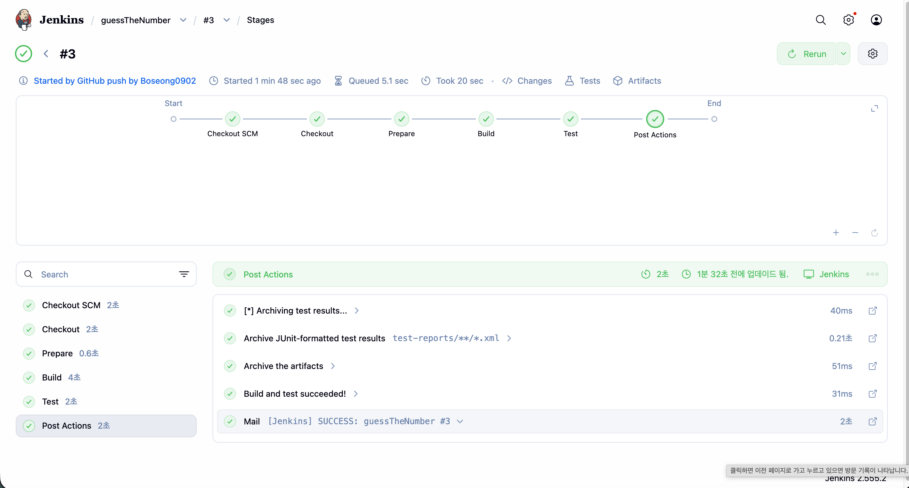

# guessTheNumber — CI/CD 실습 (Jenkins)

> ### 🎮 배포된 게임: **http://3.36.48.154:8000**

숫자 맞추기 게임(**NUM BREACH**)을 소재로 한 **GitHub + Jenkins CI/CD 파이프라인** 실습 저장소.
코드를 push하면 Jenkins가 자동으로 **빌드 → 테스트 → 배포 → 이메일 알림**까지 수행한다.

---

## 1. 과제 요구사항(CI)과 실제 구현(CD)

| 구분 | 범위 |
|------|------|
| **과제 요구사항** | **CI** — push 시 자동 빌드·테스트, 실패 원인 분석, 성공 시 결과 보관/이메일 |
| **실제 구현** | **CI + CD** — 위 모두 + 테스트 통과 시 **AWS EC2 자동 배포** |

과제에서 요구한 범위는 **CI(지속적 통합)**까지였다. 즉 코드를 push하면 Jenkins가 자동으로 빌드·테스트를 수행하고, 실패 시 원인을 파악하며, 성공 시 결과를 보관/통지하는 데까지다.

그러나 본 프로젝트는 한 단계 더 나아가 **CD(지속적 배포)까지 구현**했다. 그 이유는 다음과 같다.

Jenkins는 단순히 "빌드를 자동화하는 도구"에 그치지 않는다. 그 진짜 가치는 **빌드·테스트를 통과한 코드를 곧바로 실제 환경에 반영(배포)하는 흐름**, 즉 **CI를 CD로 이어줄 때** 발휘된다. CI만으로는 "코드가 정상인지 확인"하는 데서 끝나지만, CD까지 연결하면 "확인된 코드가 자동으로 서비스에 반영"되어 **개발 → 검증 → 배포가 하나의 끊김 없는 파이프라인**이 된다.

특히 Jenkins의 파이프라인 구조(`stages`)는 이 확장을 자연스럽게 지원한다. **Test 단계가 통과해야만 Deploy 단계로 넘어가므로, 테스트가 곧 배포의 안전장치(게이트) 역할**을 한다 — 테스트가 깨지면 불량 코드는 절대 서버에 올라가지 않는다. 이것이 CI를 CD로 확장했을 때 얻는 핵심 이점이다.

따라서 "Jenkins로 할 수 있는 것"의 본질을 끝까지 체험하기 위해, CI에서 멈추지 않고 **테스트 통과 → EC2 자동 배포**까지 연결하여 완결된 CI/CD 파이프라인을 구성했다.

---

## 2. 전체 아키텍처

```
[개발자 PC] ──git push──▶ [GitHub: SW-prac/guessTheNumber]
                                   │  webhook (push 이벤트)
                                   ▼
                          [ngrok 터널] ── 외부→로컬 연결
                                   ▼
                ┌──────────────────────────────────────┐
                │  Jenkins (로컬 Docker 컨테이너)         │
                │                                        │
                │  ① Checkout : 소스 받기                │
                │  ② Prepare  : JUnit jar 다운로드        │
                │  ③ Build    : javac 컴파일             │
                │  ④ Test     : JUnit 14개 테스트         │  ← 실패 시 여기서 중단
                │  ⑤ Deploy   : EC2로 scp (테스트 통과 시)│
                │  ⑥ Post     : txt 보관 + 이메일 발송     │
                └──────────────────────────────────────┘
                                   │ scp (SSH)
                                   ▼
                        [AWS EC2  3.36.48.154]
```

> **CI 게이트:** Java/JUnit 테스트가 통과해야만 Deploy 단계로 넘어간다. 불량 코드는 배포되지 않는다.

---

## 3. 역할 분담

세 명이 각자 다른 GitHub 신원으로 영역을 나눠 작업했다.

| 담당자 (이메일) | 역할 | 한 일 |
|-----------------|------|-------|
| **김양오** (`diddh789@gmail.com`) | 소스코드 (빌드/테스트 대상) | 게임 로직을 **Java + JUnit5** 로 포팅. `game/` 패키지(`NumberGuessingGame`, `Difficulty`, `GuessResult`, `BestScore`)와 **단위 테스트 14개** 작성. → Jenkins가 컴파일·테스트하는 대상 |
| **최인태** (`show8621@naver.com`) | Docker 세팅 (CI 실행 환경) | `guessNumberDocker/` 의 **docker-compose** 작성 — Jenkins + nGrinder(controller/agent) + ngrok 컨테이너 구성. ngrok 토큰은 `.env`(미커밋)로 분리 |
| **박보성** (`alskdj7879@gmail.com`) | Jenkins / 인스턴스 / CD | **Jenkinsfile**(파이프라인 정의) 작성, Jenkins Job·Credentials·SMTP·**GitHub webhook** 설정, **EC2 배포(Deploy 단계)** 연결 |

---

## 4. 디렉토리 구조

```
guessTheNumber/
├── Jenkinsfile                 # CI/CD 파이프라인 정의 (박보성)
├── game/                       # 빌드/테스트 대상 Java 코드 (김양오)
│   ├── src/game/
│   │   ├── Difficulty.java          # 난이도 enum (EASY/NORMAL/HARD)
│   │   ├── GuessResult.java         # 판정 결과 enum
│   │   ├── NumberGuessingGame.java  # 핵심 로직 (guess 판정, 시도 카운트)
│   │   ├── BestScore.java           # 최고기록 갱신
│   │   └── *Test.java               # JUnit5 테스트 (14개)
│   └── README.md
├── guessNumberDocker/          # Jenkins 실행용 Docker 구성 (최인태)
│   ├── docker-compose.yml           # Jenkins + nGrinder + ngrok
│   ├── .env.example                 # NGROK_AUTHTOKEN placeholder
│   └── README.md
├── index.html                  # 정적 페이지 (CD 배포 데모 대상)
└── docs/                       # 참고 스크린샷
```

> 참고: 실제로 브라우저에서 **플레이되는 게임은 JavaScript**(`number-guessing-game/` 의 `game.js`)이며, 본 저장소의 Java 코드는 **같은 규칙을 옮긴 CI 테스트 대상**이다. (서로 별개 구현)

---

## 5. 파이프라인 단계 (Jenkinsfile)

| 단계 | 내용 |
|------|------|
| Checkout | GitHub에서 소스 체크아웃 |
| Prepare | `classes/`, `test-reports/`, `lib/` 생성 + JUnit console-standalone jar 다운로드 |
| Build | `cd game && javac` 로 `.java` 컴파일 |
| Test | JUnit5 실행 → `test-reports/test-output.txt` 저장 |
| **Deploy** | **테스트 통과 시** 정적 파일을 EC2로 `scp` (자격증명 `ec2-ssh`) |
| post.always | JUnit 리포트 기록 + `archiveArtifacts` (txt 산출물) |
| post.success | **이메일 발송** (`[Jenkins] SUCCESS …`) |
| post.failure | 실패 알림 이메일 |

- 트리거: **GitHub webhook**(push 시 자동 빌드) — `GitHub hook trigger for GITScm polling`
- 알림: Gmail SMTP(`smtp.gmail.com:465`, SSL)

---

## 6. CI 실행 환경 (Docker)

`guessNumberDocker/docker-compose.yml` 로 컨테이너 4개를 띄운다 (`docker compose up -d`).

| 컨테이너 | 역할 | 포트 |
|----------|------|------|
| jenkins | CI/CD 본체 | `localhost:8081` |
| ngrok | 외부→Jenkins 터널 (webhook 수신) | — |
| controller / agent | nGrinder(부하테스트) | `:80`, `12000~` |



---

## 7. Jenkins 파이프라인 실행 결과

push 시 webhook으로 자동 트리거되어 모든 단계가 통과(초록)하는 모습.



---

## 8. 접속 정보

| 대상 | 주소 |
|------|------|
| **배포 서버 (게임)** | **http://3.36.48.154:8000** |
| Jenkins 대시보드 | `http://localhost:8081` |
| GitHub 저장소 | `https://github.com/SW-prac/guessTheNumber` |

> ⚠️ ngrok 무료 플랜은 재시작 시 공개 URL이 바뀌므로, 그때마다 GitHub webhook의 Payload URL(`…/github-webhook/`)을 갱신해야 한다.

---

## 9. Nginx · TLS · DNS를 적용하지 않은 이유

배포 서버는 Python 내장 `http.server`로 정적 파일을 **IP·평문 HTTP**로 서빙한다. 운영 환경에서 흔히 더하는 Nginx / TLS / DNS는 다음 이유로 **의도적으로 적용하지 않았다.**

- **Nginx (웹서버 / 리버스 프록시)** — 단일 인스턴스에서 저트래픽 정적 파일을 서빙하는 본 실습 환경에서는 `http.server`로 충분하다. Nginx의 강점(리버스 프록시, 로드밸런싱, 캐싱, 높은 동시성 처리)은 **운영 규모**에서 의미가 크지만, 본 프로젝트의 핵심인 **CI/CD 파이프라인 흐름과는 직접 관련이 없어** 구성을 단순하게 유지했다. 운영 전환 시 서빙 계층만 Nginx로 교체하면 된다.

- **TLS (HTTPS)** — 신뢰할 수 있는 인증서 발급(Let's Encrypt 등)은 일반적으로 **도메인 보유를 전제**로 한다. 본 실습은 IP 직접 접속 기반의 데모이고 민감 정보 전송이 없으므로 평문 HTTP로 충분하다고 판단했다. 도메인 확보 후 `certbot` 등으로 손쉽게 추가할 수 있어 범위에서 제외했다.

- **DNS (도메인)** — 도메인 등록에는 비용이 발생하며, 도메인은 본질적으로 **IP를 기억하기 쉬운 이름으로 바꿔주는 편의 기능**일 뿐 CI/CD의 동작과는 무관하다. 학습 목적상 IP 직접 접속으로 충분하여 생략했다.

> 요약: 세 가지 모두 **'운영 품질'을 높이는 요소**이지 **'CI/CD 파이프라인의 본질'은 아니므로**, 실습의 초점을 흐리지 않기 위해 의도적으로 범위에서 제외했다.
